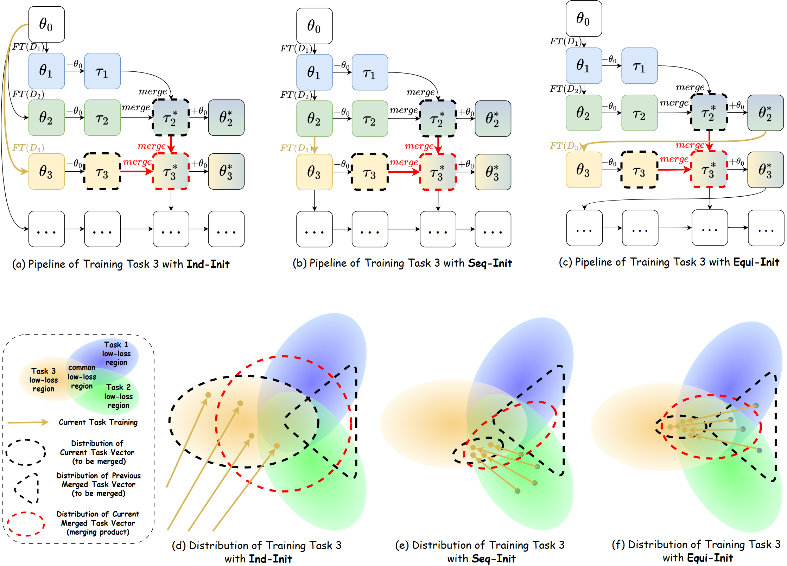

# Beyond Merging: A Three-Phase Framework for Continual Learning via Sparsified Synergistic Merging with Equilibrium Initialization


<p align="center">

</p>

> Different initialization strategies' continual learning pipelines (a-c) and influence of the distribution in parameter space (d-e), taking Task 3 as example. 
In (a-c), $\theta$ represents model parameter, $\tau$ represents task vector parameter. Blue, green, and yellow blocks represent the parameter related to Task 1, 2, and 3, respectively. Yellow arrow shows the initialization of Task 3's finetuning trajectory. Black and red dashed contour lines indicate the to-be-merged task vectors and merging-product task vectors. In (d-f), colored ellipses represent low-loss regions for the corresponding tasks. (d) Independent Initialization (Ind-Init) from the pretrained model makes the task vector of Task 3 distributed across the entire yellow region, causing the merged model (red dashed circle) to be unbiased but with high variance. (e) Sequential Initialization (Seq-Init) starts training from Task 2 (green ellipse), the resulting task vector will be distributed in the area near Task 2 within Task 3's low-loss region. When merged with previous task vectors, this yields a final distribution with low variance, but will also introduce bias among previous tasks. (f) Equilibrium Initialization (Equi-Init) causes the training trajectory to converge to areas within Task 3's low-loss region that are close to Task 1 and Task 2, resulting in a low-variance and less biased task vector, and consequently a low-variance and less biased merged task vector.

## Abstract 
Leveraging large pretrained models for continual learning remains challenging due to high variance, task bias, and parameter interference. We introduce \textbf{S}parsified \textbf{S}ynergistic Merging with \textbf{E}quilibrium Initialization \textbf{(SSE)}, a unified framework that integrates three key components: Equilibrium Initialization, which anchors each new task in a consolidated low-loss region to reduce variance; Sparse Finetuning, which confines weight updates to a small subset to alleviate bias; and Synergistic Merging, which learns optimal blending coefficients to preserve parameter interdependencies and prevent interference. In the exemplar-free setting, SSE achieves superior performance on accuracy and forgetting measure. When employing small memory buffers (1–3 exemplars per class), SSE achieves an additional 1.4–2.8\% gain on ImageNet-R and a 2.1–3.5\% gain on CIFAR100. These results demonstrate that SSE outperforms state-of-the-art continual learning methods, offering a practical solution for lifelong learning with large pretrained models.


## Usage

For continual learning on CIFAR100 (10 epochs, 5 splits, seed=5), sparsity constraint weight = 1e-2, validset ratio = 0.006, train merging coefs epoch = 10, run the script:
```bash
bash scripts/CIL/finetune_merged.sh ViT-B-16 CIFAR100 10 5 5 learned pretrained 1e-2 0.006 10
```

## Experiment Results

<p align="center">

</p>

## Credits

This repo is based on the following works:

- [MagMax](https://github.com/danielm1405/magmax)
- [Localize-and-Stitch](https://github.com/uiuctml/Localize-and-Stitch)
- [task_vectors](https://github.com/mlfoundations/task_vectors)
- [ties-merging](https://github.com/prateeky2806/ties-merging) 
